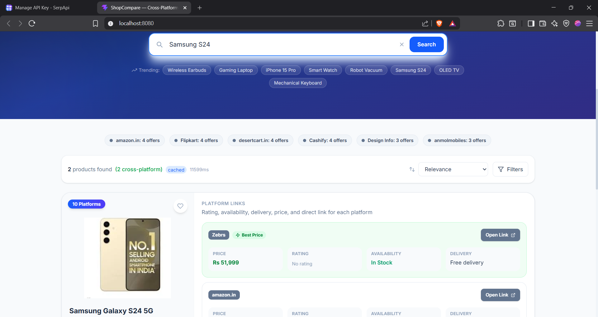
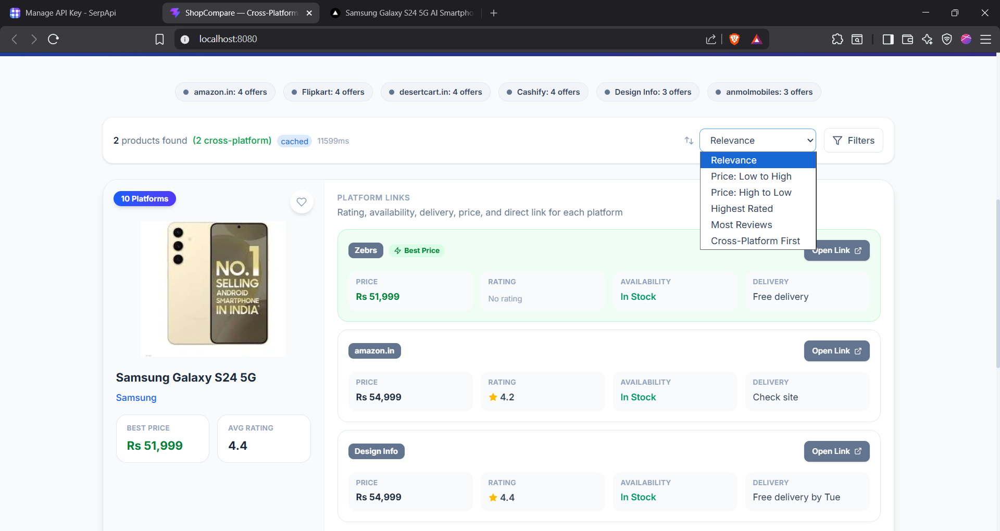
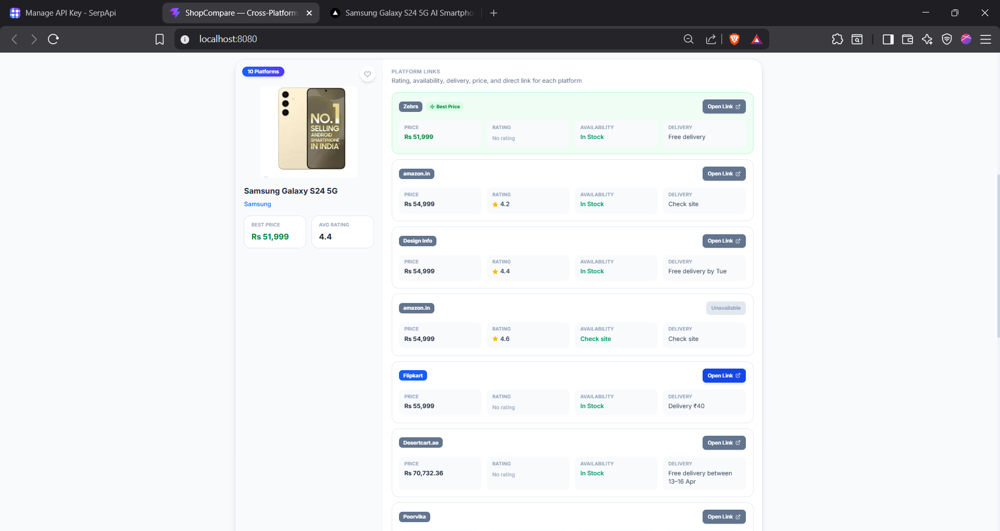

# Orchids Product Comparison Tool

A full-stack product comparison app that helps users search once and compare prices, ratings, availability, delivery, and direct store links across multiple shopping platforms.

The app has a React + Vite frontend and an Express backend. Live product data is fetched through SerpApi Google Shopping, then normalized into comparison cards with best-price highlighting and wishlist support.

## Output Screens

### Home Page


### Search Query


### Search Results



### Sort Options



### Product Offers



## Features

- Search products across online stores.
- Compare prices, ratings, availability, delivery, and store links.
- Highlight the best price for each product.
- Sort by relevance, price, rating, reviews, and cross-platform availability.
- Filter by platform and minimum rating.
- Save products to a wishlist.
- Cache repeated searches on the backend.
- Run locally or with Docker Compose.

## Tech Stack

**Frontend:** React, Vite, Tailwind CSS, Axios, Framer Motion  
**Backend:** Node.js, Express, SerpApi, Axios, NodeCache, Helmet, Morgan, Express Rate Limit

## Project Structure

```text
.
|-- backend/
|   |-- controllers/
|   |-- providers/
|   |-- routes/
|   |-- utils/
|   |-- .env.example
|   `-- server.js
|-- frontend/
|   |-- src/
|   |   |-- components/
|   |   |-- hooks/
|   |   |-- pages/
|   |   `-- services/
|   `-- vite.config.js
|-- docs/screenshots/
|-- docker-compose.yml
|-- DOCKER.md
`-- README.md
```

## Setup

Create the backend environment file:

```bash
cd backend
cp .env.example .env
```

Set your SerpApi key in `backend/.env`:

```env
SERPAPI_KEY=your_serpapi_key_here
USE_MOCK=false
```

Install and run the backend:

```bash
cd backend
npm install
npm run dev
```

Install and run the frontend in another terminal:

```bash
cd frontend
npm install
npm run dev
```

Local URLs:

- Frontend: `http://localhost:3000`
- Backend: `http://localhost:5000`
- Health check: `http://localhost:5000/api/health`

## Docker

From the project root:

```bash
docker compose up --build
```

Docker URLs:

- Frontend: `http://localhost:8080`
- Backend: `http://localhost:5000`

## Render Deployment

Render service URLs:

- Frontend: `https://orchids-product-comparison-tool-1.onrender.com`
- Backend: `https://orchids-product-comparison-tool.onrender.com`

When deploying the frontend and backend as separate Render services, set this
environment variable on the frontend service:

```env
VITE_API_BASE_URL=https://orchids-product-comparison-tool.onrender.com/api
```

Then redeploy the frontend so Vite includes that API URL in the built assets.
The backend service also needs `SERPAPI_KEY` for live search, or `USE_MOCK=true`
for demo search results.

## API Endpoints

- `GET /api/health` - backend health check
- `GET /api/search?q=<query>` - search products
- `GET /api/wishlist` - get wishlist items
- `POST /api/wishlist` - add item to wishlist
- `DELETE /api/wishlist/:id` - remove item from wishlist

## Notes

- Wishlist data is stored in memory, so it resets when the backend restarts.
- Live search requires a valid SerpApi key.
- Set `USE_MOCK=true` in `backend/.env` to use demo fallback data.
- The active live search flow uses SerpApi; scraper files are present but not the main provider path.
